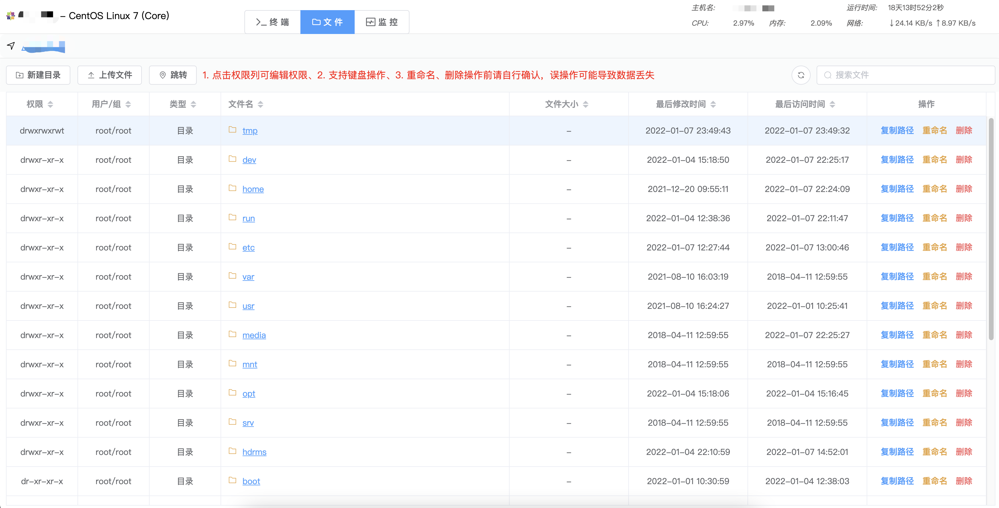

# Auto Command

最近一个项目负责了近百台服务器，因处于项目初期，部署、调试过于繁琐

之前写过一个基于yaml的任务引擎，但yaml编辑还是比较麻烦，反正年底没事，做个WEB端玩玩

看过市面上类似产品有点复杂，不太适合我这种不专业做维护的去玩的

为啥不用sh脚本? 因为有些功能实现起来太麻烦，除非写程序配合

---


## 一些特点?
- 纯 [Node.js](https://nodejs.org/en/) 实现
- 持久化使用 [JSON](https://developer.mozilla.org/en-US/docs/Web/JavaScript/Reference/Global_Objects/JSON) + [alasql](https://github.com/agershun/alasql)  -- 不想去部署一堆乱七八糟的东西，反正数据量肯定大不了
- 通讯层封装了下 [WebSocket](https://developer.mozilla.org/en-US/docs/Web/API/WebSocket)
- 最小化的dependencies
- 基于 [vite](https://vitejs.dev) -- 不得不说，真的快，这个真是吹一波

---

## 规划功能（√为已完成，部分代码未完成或存在问题未提交）
- 服务器管理
  - 基本信息查看 √
  - WEB SSH 
    - 基本信息 √
    - shell √
    - sftp
      - 新建目录 √
      - 上传文件 √
      - 上传文件夹 √
      - 下载文件 √
      - 重命名 √
      - 删除 √
      - 复制路径 √
      - 键盘操作 √
      - 路径跳转
    - monitor
      - CPU √
      - 内存 √
      - 网络 √
      - 进程 √
      - 挂载信息 √
  - 修改随机密码 √
  - 自动生成authorized_keys √
- 任务
  - 公共资源 √
  - 任务编辑 ×
  - 任务调度 ×
  - 运行日志 ×

---

## images





---

## 之前任务引擎一个相对简单的yaml脚本
```yaml
name: deploy hdrms
server:
  - name: xxxx
    host: 192.168.30.100
    password: 123456
  - name: xxxx
    host: 192.168.30.101
    password: 123456
  ...
    
env:
  rootPath: /hdrms
  curPwd:
  passwd:
  node:

initScript: |
    if (!env.node){
      env.node = {}
    }
    const envPath = join(cfg.name + '-env.json')
    if (fs.existsSync(envPath)){
      Object.assign(env, JSON.parse(fs.readFileSync(envPath).toString()))
    }
    if (!env.node[node.host]){
      env.node[node.host] = { mysql: generatePasswd(32), key: '', name: node.name }
    }
    env.curPwd = env.node[node.host].mysql

commands:
  - name: 建立根目录/hdrms
    cmd: mkdir /hdrms
    cond:
      path: /hdrms
      complete: true
      reverse: true

  - name: 安装nodejs17.3
    include: yaml/install_node.yml

  - name: 初始化系统
    include: yaml/init_centos.yml

  - name: 安装Docker
    include: yaml/install_docker.yml

  - name: 上传大屏服务
    include: yaml/pack_hdrms_big_screen.yml

  - name: 安装JDK
    include: yaml/install_jdk.yml

  - name: 安装docker-compose
    cmd:
      - curl -L https://get.daocloud.io/docker/compose/releases/download/1.25.0/docker-compose-`uname -s`-`uname -m` -o /hdrms/docker-compose
      - chmod -R 777 /hdrms/docker-compose
      - ln -s /hdrms/docker-compose /usr/local/bin/docker-compose
      - ln -s /hdrms/docker-compose /usr/bin/docker-compose
    cond:
      cmd: docker-compose --version | grep version
      content: version

  - name: 上传HDRMS节点服务端
    action: uploadFileSteam
    params:
      - script: join('server')
      - /hdrms/server
    cond:
      path: /hdrms/server
      complete: true
      reverse: true

  - name: 写入HDRMS节点服务文件
    action: writeFile
    params:
      - /usr/lib/systemd/system/hdrms.service
      - script: fs.readFileSync(join('hdrms.service'))
      
  - name: 设置节点服务权限
    cmd: chmod 777 /hdrms/server

  - name: 创建资源文件夹
    cmd: mkdir /hdrms/Resources
    cond:
      path: /hdrms/Resources
      complete: true
      reverse: true
      
  - name: 生成节点配置文件
    script: |
        const res = await exec('/hdrms/server -t mysql -u root -w ' + env.curPwd + ' -i ' + node.host + ':3306')
        const key = res.split('\n')[0]
        await exec(`echo "${key}" > /hdrms/server.cfg`)
      
  - name: 上传mysql8-docker-compose包
    action: uploadDir
    params:
      - script: join('mysql8')
      - /hdrms/mysql8
    cond:
      path: /hdrms/mysql8
      complete: true
      reverse: true
      
  - name: 设置mysql8密码
    action: writeFile
    params:
      - /hdrms/mysql8/.env
      - script: |
          return readFileReplace(join('./mysql8/.env'), { s: 'MYSQL8PASSWD', d: env.curPwd })
    cond:
      cmd: docker ps -a | grep mysql8
      content: mysql8
      complete: true
      reverse: true
    
  - name: 启动mysql8
    cmd: docker-compose -f /hdrms/mysql8/docker-compose.yml --env-file /hdrms/mysql8/.env up -d
    cond:
      cmd: docker ps -a | grep mysql8
      content: mysql8
      complete: true
      reverse: true

  - name: 启动节点服务
    cmd: systemctl daemon-reload && systemctl restart hdrms && systemctl enable hdrms
    cond:
      cmd: systemctl daemon-reload && systemctl status hdrms | grep running
      content: running

  - name: 延迟
    script: await sleep(5000)

  - name: 获取节点密钥
    script: |
        const res = await exec('systemctl status hdrms | grep key:')
        if (res){
          env.node[node.host].key = res.trimEnd().split('key:')[1]
        }
        if (!env.node[node.host].key){
          throw new Error('获取节点密钥失败: ' + res)
        }
    cond:
      script: "!!env.node[node.host].key"
      complete: true
      reverse: true

  - name: 写入HDRMS-big-screen服务文件
    action: writeFile
    params:
      - /usr/lib/systemd/system/hdrmsbs.service
      - script: fs.readFileSync(join('hdrmsbs.service'))
    cond:
      path: /usr/lib/systemd/system/hdrmsbs.service
      complete: true
      reverse: true
      
  - name: 启动HDRMS-big-screen服务
    cmd: systemctl daemon-reload && systemctl restart hdrmsbs && systemctl enable hdrmsbs
    cond:
      cmd: systemctl daemon-reload && systemctl status hdrmsbs | grep running
      content: running

  - name: 保存环境变量
    script: fs.writeFileSync(join(cfg.name + '-env.json'), JSON.stringify(env, '', '\t'))
    
```
- 支持对多台服务器（并行、串行）执行任务（nodejs cluster）
- 环境变量
- 条件验证，命令执行完成后的二次验证
- JS脚本，并支持node部分包、功能 (nodejs vm)
- 任务拆分 (include)

总体来说是能满足我个人需求的，但编写脚本比较麻烦，尤其是脚本部分

后面会逐步完善本项目的任务编辑部分

# ps: 忽略掉前端里扯淡的布局和样式，我能弄成这样我都觉得已经100分了，都是各种项目里东一点西一点扣出来的

### 代码部分目前仅为了实现功能，还来不急做优化，很多部分是不规范的，比如...异常处理、命名
### 主要是，我被布局搞疯了，代码写了3天，布局花了2天半!!!!!!


## Server Dependencies
| module                | 说明                                                                                                                                  |
|-----------------------|:------------------------------------------------------------------------------------------------------------------------------------|
| [alasql](https://github.com/agershun/alasql) | sql语法查询实现                                                                                                                           |
| [express](https://github.com/expressjs/express) | 后端框架                                                                                                                                |
| [express-ws](https://github.com/HenningM/express-ws) | 精简后集成至项目中                                                                                                                           |
| [connect-history-api-fallback](https://github.com/bripkens/connect-history-api-fallback) | 精简后集成到项目中                                                                                                                           |
| [ssh2](https://github.com/mscdex/ssh2) | 集成至项目中，去除crypto gyp部分                                                                                                               |
| [ssh2-promise](https://github.com/sanketbajoria/ssh2-promise) | 参考部分代码实现                                                                                                                            |
| [utf8](https://github.com/mathiasbynens/utf8.js) | 保留encode部分代码，集成至项目中                                                                                                                 |
| [electerm](https://github.com/electerm/electerm) | 监控模块想法来源与这个工具， 代码是这部分 [run-cmd.js](https://github.com/electerm/electerm/blob/master/src/client/components/terminal-info/run-cmd.js) |
| [multer](https://github.com/expressjs/multer) | 参考实现文件上传部分                                                                                                                          |
| [busboy](https://github.com/mscdex/busboy) | 文件上传headers解析                                                                                                                       |

## Web Dependencies
| module                       | 说明           |
|------------------------------|:-------------|
| [vite](https://vitejs.cn)    | 好快!!!        |
| [vue3](https://v3.vuejs.org) | 语法有点怪        |
| [element-plus](https://element-plus.gitee.io/zh-CN/component/button.html) | -            |
| [xterm](https://github.com/xtermjs/xterm.js) | Web Terminal |
| [typescript](https://www.typescriptlang.org) | - |
| [scss](https://github.com/sass/dart-sass) | - |
