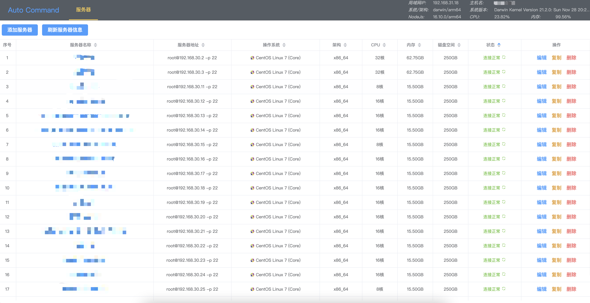

# Auto Command
Without using a database, the data is stored in a JSON file

## features
- only use [Node.js](https://nodejs.org/en/)
- without using a database, the data is stored in a  [JSON](https://developer.mozilla.org/en-US/docs/Web/JavaScript/Reference/Global_Objects/JSON) + [alasql](https://github.com/agershun/alasql)
- [WebSocket](https://developer.mozilla.org/en-US/docs/Web/API/WebSocket)
- minimize dependencies

---

## planning
- server manage
  - basic information √
  - web ssh 
    - basic information √
    - shell √
    - sftp
      - mkdir √
      - upload file、folder √
      - download √
      - rename √
      - delete √
      - copy path √
      - keyboard operation  √
      - goto path √
    - monitor
      - cpu √
      - mem √
      - network √
      - process √
      - mount √
  - modify the random password √
  - automatic generation authorized_keys √
- task
  - public resource √
  - edit ×
  - dispatch ×
  - log ×

---

## Getting started

```bash
# clone the project
git clone https://github.com/hlxxzt/auto-command.git

# enter the project web directory
cd auto-command/web

# install dependency and build
yarn && yarn build

# enter the project server directory
cd ../server

# install server dependency and run server
yarn && yarn run start
```

browser open http://localhost:3100

---

## images




---

## Server Dependencies
| module                | explain                                                                                                                                |
|-----------------------|:------------------------------------------------------------------------------------------------------------------------------------|
| [alasql](https://github.com/agershun/alasql) | sql语法查询实现                                                                                                                           |
| [express](https://github.com/expressjs/express) | 后端框架                                                                                                                                |
| [express-ws](https://github.com/HenningM/express-ws) | 精简后集成至项目中                                                                                                                           |
| [connect-history-api-fallback](https://github.com/bripkens/connect-history-api-fallback) | 精简后集成到项目中                                                                                                                           |
| [ssh2](https://github.com/mscdex/ssh2) | 集成至项目中，去除crypto gyp部分                                                                                                               |
| [ssh2-promise](https://github.com/sanketbajoria/ssh2-promise) | 参考部分代码实现                                                                                                                            |
| [utf8](https://github.com/mathiasbynens/utf8.js) | 保留encode部分代码，集成至项目中                                                                                                                 |
| [electerm](https://github.com/electerm/electerm) | 监控模块想法来源与这个工具， 代码是这部分 [run-cmd.js](https://github.com/electerm/electerm/blob/master/src/client/components/terminal-info/run-cmd.js) |
| [multer](https://github.com/expressjs/multer) | 参考实现文件上传部分                                                                                                                          |
| [busboy](https://github.com/mscdex/busboy) | 文件上传headers解析                                                                                                                       |

## Web Dependencies
| module                       | explain             |
|------------------------------|:-------------|
| [vite](https://vitejs.cn)    | -            |
| [vue3](https://v3.vuejs.org) | -            |
| [element-plus](https://element-plus.gitee.io/zh-CN/component/button.html) | -            |
| [xterm](https://github.com/xtermjs/xterm.js) | web terminal |
| [typescript](https://www.typescriptlang.org) | -            |
| [scss](https://github.com/sass/dart-sass) | -            |
| [monaco-editor](https://github.com/microsoft/monaco-editor)| -            |